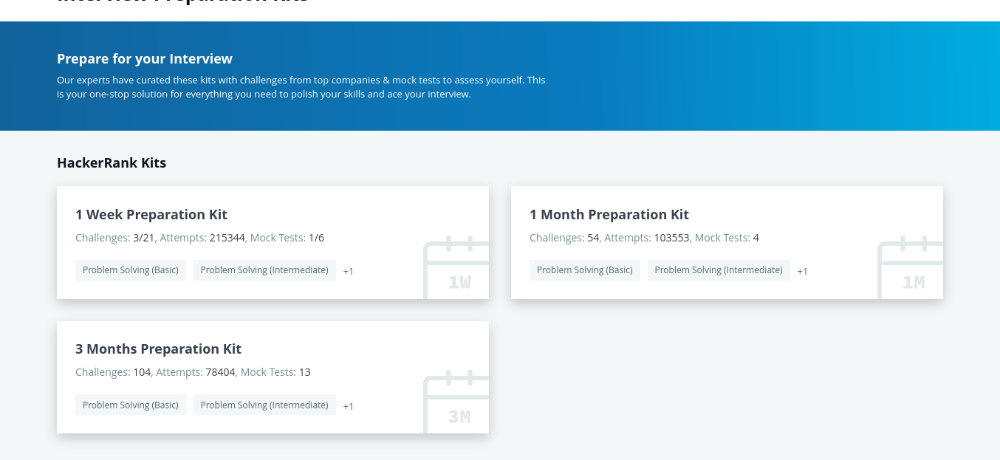

# interview preparation kit with hackerrank

<!-- don't use "" to markdown -->

## [day1](day1/main.go)
- findTheMedian
- timeConv
- miniMaxSum
- plusMinus

## [day3]
- need learn tower breakers more difficult to understand question
- fix pass parameter 

## [day4]
- focus to problem, make efficient code count complexity your code big Notation, and readability
- skip to mock code, need back and try again [day4/main.go](day4/main.go) # mocktest

## [day5]
- simulation test case from easy to hard
